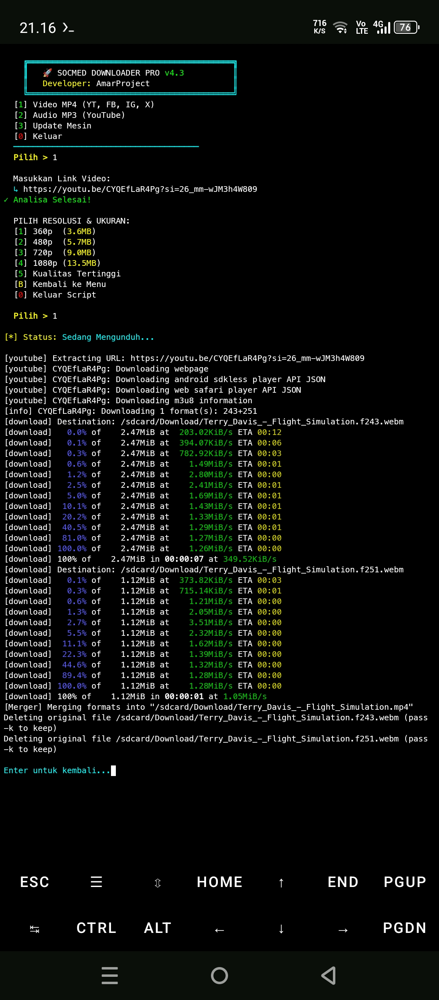

# 📥 Universal Media Downloader
**Developer: AmarProject**

Tool otomatisasi untuk mengunduh video dan audio dari berbagai platform sosial media terbesar hanya dengan satu klik!

## 🌍 Platform Didukung
* YouTube, Facebook, Instagram, Twitter (X), TikTok, dan 100+ situs lainnya.

## ✨ Keunggulan
* **Clipboard Monitor:** Otomatis mendeteksi link yang Anda copy.
* **Format Selector:** Pilih antara Video (MP4) atau Audio (MP3).
* **Tanpa Iklan:** Proses download bersih langsung dari terminal.
* <p align="center">
  
</p>

## 📥 Instalasi
```bash
pkg install python ffmpeg termux-api git
pip install yt-dlp
git clone https://github.com/Amar-star1/Downloader
cd Downloader
python downloader.py
